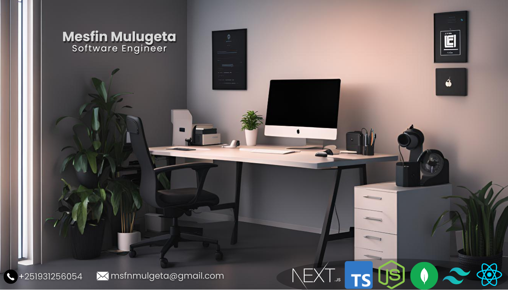

##### ALX Africa Software Engineering (Back-End Specializtion) graduate
##### Evangadi Tech Fullstack web development (MERN) graduate

I’m looking to collaborate on **any fun project**
How to reach me:-
- Email: **msfnmulgeta@gmail.com**
- Tel: (+251) 931 25 60 54
- Github: [https://github.com/5237-mests](https://github.com/5237-mests)
- LinkedIn: [https://www.linkedin.com/in/mesfin-mulgeta/](https://www.linkedin.com/in/mesfin-mulgeta/)

All of my projects are available at [https://github.com/5237-mests](https://github.com/5237-mests)

<h3 align="left">Connect with me:</h3>

<h3 align="left">My Skills:</h3>

  

&nbsp;
  

